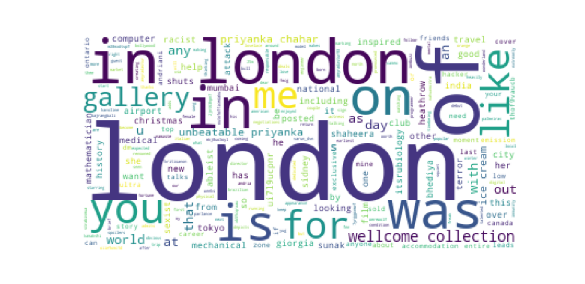

# Tweet Analysis

Twitter allows users to mine tweets with it's API. And we now use it to find the most used words in a given number of tweets in wordcloud format.

## Getting Started

Create a twitter account, and verify your phone number.
[Sign up](https://twitter.com/i/flow/login?input_flow_data=%7B%22requested_variant%22%3A%22eyJyZWRpcmVjdF9hZnRlcl9sb2dpbiI6Imh0dHBzOi8vZGV2ZWxvcGVyLnR3aXR0ZXIuY29tL2VuL3BvcnRhbC9wZXRpdGlvbi9lc3NlbnRpYWwvYmFzaWMtaW5mbyJ9%22%7D) for developer access.

### Prerequisites

1. Tweepy
1. Twitter API key and Access Token
1. Configparser
1. Wordcloud
1. sklearn
1. collections
  
### Prerequisites installation

```
pip install tweepy
pip install configparser
pip install wordcloud
pip install sklearn
pip install collections
```

## How to execute the file

Download the config file, add your API key, API key secret, Access Token, Access Token Secret. <br>
Now download final.py file and open it in VS Code or in any IDE that can run python. <br>
Enter your keyword, geolocation and set the limit. <br>
You can now start running the code and the tweets will be collected in the CSV file. <br>
Download visualization.py and run it to get the tweets in the wordcloud format.


## Output
1. Wordcloud - 300 Tweets


1. Wordcloud - 600 Tweets


1. Wordcloud - 1200 Tweets


## Author

* [Abishek-Reddy](https://github.com/Abishek-Reddy)

## License

This project is licensed under the MIT License - see the [LICENSE.md](LICENSE.md) file for details

## References

* AI Spectrum
* Tweepy documentation
* Stack Overflow

